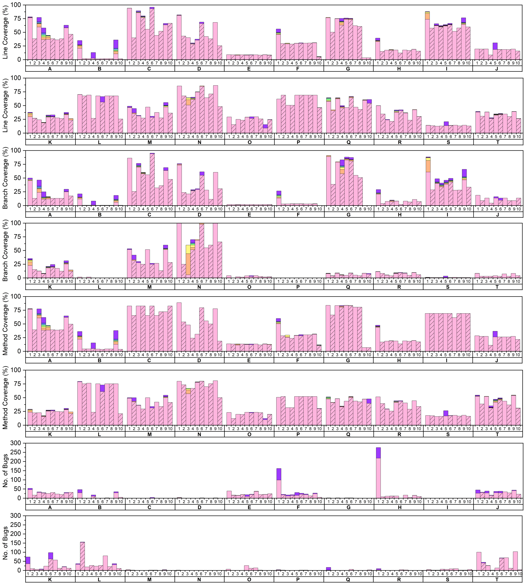

# Automated Test Generation for REST APIs: No Time to Rest Yet

## Getting Started

### Check the basic functionality

In this section, we give instructions to check the basic functionality of this artifact.
We show how our tool works with project-tracking-system service.

### Requirements

We used Google Cloud e2-standard-4 machines running Ubuntu 20.04 for this project, but any platform with the requirements below would work.

- Requirements: Java8, Java11, Git, Sudo, Wget, Zip, Unzip, MVN, Gradle, Python3.8-pip, Virtualenv, NodeJS v10.19, and Docker 20.10. 

### Setup

The setup script is tested in Google Cloud e2-standard-4 (Ubuntu 20.04).
You can manually set up the requirements, but you can use the setup script if you are using the same environment as us.

```
cd REST_Go # Go to the root directory
sh small_setup.sh
```

It will take around 18 minutes and 30 seconds.

### Run

You can run the service and tool using run_small.py. The python script runs the service for six minutes.
You should have the tool name and port number. Possible tool names can be evomaster-whitebox, evomaster-blackbox, restler, restest, resttestgen, bboxrt, schemathesis, dredd, tcases, and apifuzzer.
The port number is for collecting the achieved code coverage. You can pick any available port number which is not in use.
Before running the script, please make sure you are using the virtualenv.
Also, you should not remove previous sessions if you have. You can refer to the `Stop Session` section for this information.

```
source venv/bin/activate
python3 run_small.py {tool_name} {port_number}
```

It will automatically start the service and coverage collecting script. You can check them with the command "tmux ls" and kill them with the command "tmux kill-sess -t {session name}."

### Generate Report

We provide a python script which automatically generates a report for the experiment you have done. 

```
python3 report_small.py {port_number}
```

You can see the result in data/project-tracking-system/res.csv!
You can also find the detailed error message and time log in data/project-tracking-system/error.json and data/project-tracking-system/time.json.
The data/project-tracking-system/res.csv has seven rows and three columns. 
The first six rows show the coverage achieved in 1, 2, 3, 4, 5, and 6 minutes. For these rows, each column shows the percentage of achieved line, branch, and method coverage.
The last row stands for the found error. The columns are the number of found errors, unique errors, and library errors.

### Stop session

Users can stop service and tmux sessions using the following command.

```
tmux ls # To find the session lists
python3 stop_service.py {session name}
```

## Detailed Description

### Setup

It has the same dependency as the Getting Started section, but we need to build each service.
We provide a setup script to install the requirements and build the services. The script was tested on Google Cloud e2-standard-4 machines running Ubuntu 20.04.

```
sh setup.sh
```

We have configured database for each service using the Docker, and that is automatically done when you run the service. However, users need to manually run Private Ethereum network for ERC20-rest-service.
To setup the Ethereum network, users can follow the commands below.

```
tmux new -s ether # Create a session for ethereum
geth --datadir ethereum init genesis.json
geth --networkid 42 --datadir ethereum --http --http.port 8545 --http.corsdomain "*" --http.api "admin,db,eth,debug,miner,net,shh,txpool,personal,web3" --port 30303 --mine --allow-insecure-unlock console
>> personal.unlockAccount("05f4172fda1cf398fad85ceb60ad9f4180f0ab3a", "11")
>> miner.start(1) # wait until mine process starts
>> personal.unlockAccount("05f4172fda1cf398fad85ceb60ad9f4180f0ab3a", "11")
# press ctrl + b + d to detach the session # For Mac, command + b + d 
```

Now you are ready to run the experiment!

### How to run the tool?

You can run EvoMasterWB, EvoMasterBB, RESTler, RESTest, RestTestGen, bBOXRT, Schemathesis, Dredd, Tcases, and APIFuzzer for the services.
The possible services are cwa-verification, erc20-rest-service, features-service, genome-nexus, languagetool, market, ncs, news, ocvn, person-controller, problem-controller, project-tracking-system, proxyporint, rest-study, restcountries, scout-api, scs, spring-batch-rest, spring-boot-sample-app, and user-management through our python script.
You can pick any free port number for the port name. The port number is for collecting the achieved code coverage.
Before run the script, make sure you are using the virtualenv.
Also, you should not remove previous sessions if you have. You can refer to `Stop Session` section for this information.

```
source venv/bin/activate
python run_tool.py {tool_name} {service_name} {time_limit}
```

### Generate a report.

You can analyze the result. You provide the automatic reporting script.


```
python3 report.py {port number} {service name}
```

The report has seven rows and three columns. 
The first six rows show the coverage achieved in 10, 20, 30, 40, 50, and an hour. For these rows, each column shows the percentage of achieved line, branch, and method coverage.
The last row stands for the found error. The columns are the number of found error, unique error, and library error.
You can compare the result to our result in the paper!

### Stop session

Users can stop service using the following command. 

```
tmux ls # To find the session lists
python3 stop_service.py {session name}
```

### Result



1: Evo-White, 2: RESTler, 3: RestTestGen, 4: RESTest, 5: bBOXRT , 6: Schemathesis, 7: Tcases, 8: Dredd, 9: Evo-Black, 10: APIFuzzer, A: Features-Service, B: Languagetool, C: NCS, D: News, E: OCVN, F: ProxyPrint, G: Restcountries, H: Scout-API, I: SCS, J: ERC20-Rest-Service, K: Genome-Nexus, L: Person-Controller, M: Problem-Controller, N: Rest-Study, O: Spring-Batch-Rest, P: Spring-Boot-Sample-App, Q: User-Management, R: CWA-Verification, S: Market, T: Project-Tracking-System. The color of the bar represents the running time - 10 min: , 20 min: , 30 min: , 40 min: , 50 min: , 60 min: , and 24 hr: .
